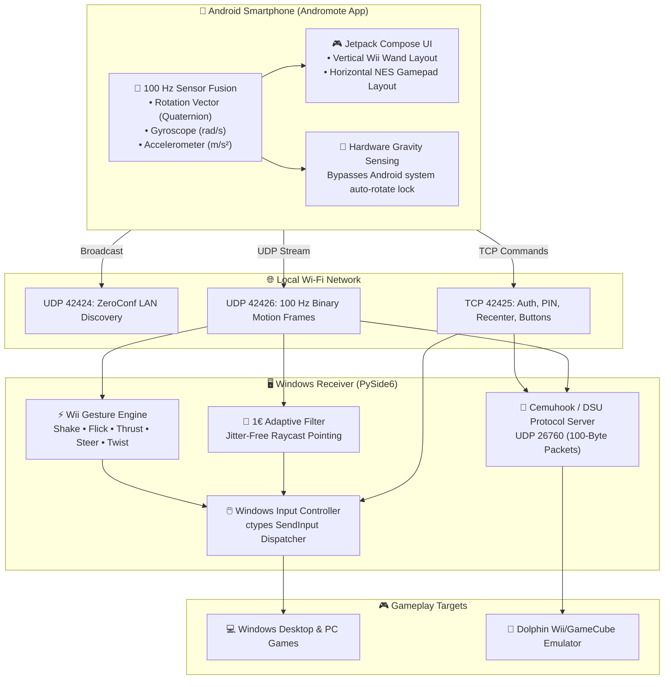
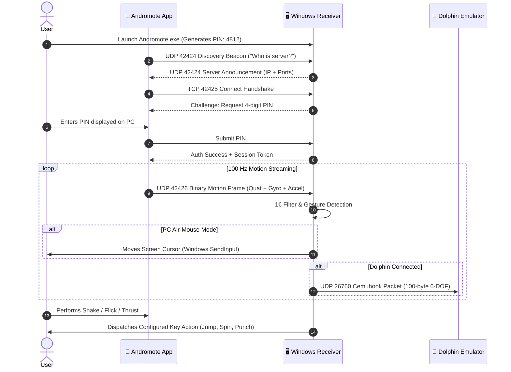
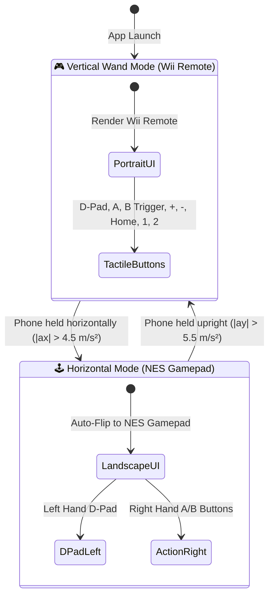

# Andromote 🎮📱

<div align="center">

[](#)
[](https://www.python.org/)
[](https://kotlinlang.org/)
[](https://dolphin-emu.org/)
[](https://github.com/Hndrd0/Andromote/actions)
[](https://opensource.org/licenses/MIT)

**Turn any Android smartphone into an authentic, ultra-low-latency Nintendo Wii Remote, motion air-mouse, and retro NES gamepad for Windows PCs and the Dolphin Emulator.**

[Features](#-key-features) • [Architecture](#-system-architecture) • [Quick Start](#-quick-start) • [Dolphin Setup](#-dolphin-emulator-setup) • [Gestures](#-wii-motion-gestures) • [Downloads](https://github.com/Hndrd0/Andromote/releases)

</div>

---

## 🌟 Key Features

| Feature | Description |
| :--- | :--- |
| 🎮 **Wii Remote Wand UI** | Tactile Jetpack Compose interface with D-Pad, oversized A button, underside B trigger, `—`, `+`, `🏠` Home, `1`, `2`, and player LED indicators. |
| 🕹️ **Auto-Rotating NES Mode** | Turn phone sideways to switch into an ergonomic retro NES gamepad. Powered by **hardware-gravity sensing** that works even with system auto-rotate lock ON! |
| 🎯 **1€ Adaptive Filter** | Fused 3D quaternion raycasting with a **One-Euro (1€) filter** eliminates hand micro-tremors while providing zero-lag response during rapid sweeps. |
| ⚡ **Wii Physical Gestures** | Detects Rapid Shaking, Wrist Snapping, Straight Thrusts, Wii Wheel Tilt Steering, Off-Screen Reloading, and Key Twisting in real time. |
| 🐬 **Native Dolphin DSU Server** | Embedded Cemuhook / DSU server on UDP `26760` with exact 100-byte packet alignment for authentic motion controls in *Mario Galaxy*, *Skyward Sword*, etc. |
| 💥 **Off-Screen Aim & Reload** | Aiming away from your monitor ($>32^\circ$) freezes cursor wandering and triggers instant weapon reload (`KEY_R` / Right-Click). |
| 📶 **Zero-Config LAN Setup** | UDP broadcast auto-discovery (`42424`) connects instantly over Wi-Fi without typing IP addresses, secured with 4-digit PIN authentication (`42425`). |
| 🛡️ **Failsafe Watchdog** | Native Windows `SendInput` dispatcher with an automatic watchdog timer that releases held buttons if Wi-Fi drops. |

---

## 🏗️ System Architecture



---

## 🔄 Connection & Motion Pipeline



---

## 🕹️ Dual-Layout State Machine

The phone automatically transitions between layouts based on real physical gravity:



> [!NOTE]
> This orientation engine relies directly on raw gravity vector math rather than Android OS window rotation events. It flips instantly even when Android's system-wide auto-rotate lock is enabled!

---

## ⚡ Wii Motion Gestures

In the Windows receiver, open the **Wii Gestures** tab to toggle each gesture, assign custom keybinds, and view live glowing green HUD badges:

| Gesture | Real-World Motion | In-Game Action / Default Key |
| :--- | :--- | :--- |
| **⚡ Rapid Shaking** | Shake phone quickly back and forth | Spin attack / Shake off (`KEY_SPACE`) |
| **🎣 Wrist Snapping** | Sharp upward flick of the wrist | Cast fishing line / Jump (`KEY_UP`) |
| **🥊 Straight Thrust** | Punch / thrust phone straight forward | Jab / Sword lunge (`KEY_F`) |
| **🏎️ Tilt Steering** | Lean horizontal phone like a steering wheel | Steer Left / Right (`KEY_A` / `KEY_D`) |
| **💥 Off-Screen Reload** | Aim phone away from the monitor ($>32^\circ$) | Reload weapon (`KEY_R` / Right-Click) |
| **🔑 Key Twisting** | Fast wrist roll / tilt | Peek / Roll sideways (`KEY_Q` / `KEY_E`) |

---

## 🐬 Dolphin Emulator Setup

Andromote embeds a native **Cemuhook DSU server** on UDP port `26760`.

### Step-by-Step Configuration:
1. Open **Dolphin Emulator** → click **Controllers**.
2. Under **Wii Remotes**, set **Wii Remote 1** to **Emulated Wii Remote** → click **Configure**.
3. Under **Motion Input**, check **Alternate Input Sources** (DSU Client):
   * **Server Address:** `127.0.0.1`
   * **Port:** `26760`
4. At the top of the Configure window, set **Device** to: `DSUClient/0/...`
5. **Button Mapping Table:**
   Click each button field in Dolphin and press the corresponding button on your phone (or right-click and type the string directly):

| Wii Remote Function | Phone Button | Dolphin Detected ID | Direct String |
| :--- | :--- | :--- | :--- |
| **Home** | 🏠 Home | **`PS`** | `PS` |
| **A** | A Button | **`Cross`** | `Cross` |
| **B (Trigger)** | B Trigger | **`R2`** | `R2` |
| **1** | 1 Button | **`Square`** | `Square` |
| **2** | 2 Button | **`Circle`** | `Circle` |
| **+ (Plus)** | + Button | **`Options`** | `Options` |
| **— (Minus)** | — Button | **`Share`** | `Share` |
| **D-Pad Up** | ▲ Up | **`Pad N`** | `Pad N` |
| **D-Pad Down** | ▼ Down | **`Pad S`** | `Pad S` |
| **D-Pad Left** | ◀ Left | **`Pad W`** | `Pad W` |
| **D-Pad Right** | ▶ Right | **`Pad E`** | `Pad E` |

> [!TIP]
> You can also load the pre-made profile [dolphin_profiles/WiimoteNew.ini](dolphin_profiles/WiimoteNew.ini) directly in Dolphin via **Profile → Load**!

---

## 🚀 Quick Start

### 1. Download & Launch Windows Receiver
Download `Andromote.exe` from the [Latest Releases](https://github.com/Hndrd0/Andromote/releases) and launch it.
Take note of the **4-digit PIN** displayed on the dashboard.

### 2. Install Android App
Download `Andromote.apk` from [Releases](https://github.com/Hndrd0/Andromote/releases) to your phone and install:
```cmd
adb install -r Andromote.apk
```

### 3. Connect & Play
1. The app automatically scans and discovers your PC over Wi-Fi. Tap your PC name.
2. Enter the 4-digit PIN displayed on your PC.
3. Aim your phone at the screen like a Wii Remote to control the cursor!
4. Tap **A** to left-click, **B** to right-click, or tap **🎯 Recenter** at any time to re-zero your reference center.

---

<details>
<summary><b>📐 Technical Deep-Dive: 1€ Filter & Motion Math</b></summary>

### 1€ (One-Euro) Filter
Traditional Exponential Moving Average (EMA) filters introduce lag during fast motions when smoothing jitter at rest. Andromote implements the **Casiez et al. 1€ Filter** with adaptive cutoff frequency:

$$\hat{x}_i = \alpha x_i + (1 - \alpha) \hat{x}_{i-1} \quad \text{where} \quad \alpha = \frac{1}{1 + \frac{\tau}{\Delta t}}, \quad \tau = \frac{1}{2\pi f_c}$$

The cutoff frequency $f_c$ scales dynamically with the derivative of speed:

$$f_c = f_{c,\min} + \beta \cdot |\dot{x}|$$

* **Low Speed ($|\dot{x}| \approx 0$):** $f_c$ drops to $f_{c,\min} = 1.0\text{ Hz}$, delivering a rock-solid cursor with zero hand trembling.
* **High Speed ($|\dot{x}| \gg 0$):** $f_c$ scales up proportionally via $\beta = 0.05$, yielding immediate responsiveness for sweeps, flicks, and FPS aiming.

</details>

<details>
<summary><b>🛠️ Building from Source</b></summary>

### Windows Receiver (Python)
* Requires **Python 3.10+**.
```cmd
git clone https://github.com/Hndrd0/Andromote.git
cd Andromote
pip install -r requirements.txt
python windows/main.py
```

To compile a standalone `.exe`:
```cmd
python windows/build_exe.py
# Output generated in dist/Andromote.exe
```

### Android App (Kotlin / Compose)
* Requires **Android Studio Ladybug+** and **JDK 21**.
```bash
cd android
./gradlew assembleDebug
# Output generated in android/app/build/outputs/apk/debug/app-debug.apk
```

</details>

<details>
<summary><b>🧪 Automated Test Suite</b></summary>

Andromote includes 22 automated unit and integration tests across 5 suites (100% passing):
```bash
python windows/tests/test_phase1.py   # Math utils, Quaternion, 1€ Filter, WinInput, Settings
python windows/tests/test_phase2.py   # Pairing PIN, Handshake, UDP Motion Framing
python windows/tests/test_dsu.py      # Dolphin Cemuhook 100-byte & PS Button
python windows/tests/test_e2e.py      # Full client-server synthetic stream
python windows/tests/test_gestures.py # Shake, Flick, Thrust, Steer, Off-Screen, Twist
```

</details>

---

## 📄 License

Distributed under the **MIT License**. See [`LICENSE`](LICENSE) for more details.

---

## 🤝 Contributing

Contributions, bug reports, and suggestions are warmly welcomed! Please read [`CONTRIBUTING.md`](CONTRIBUTING.md) to get started.
