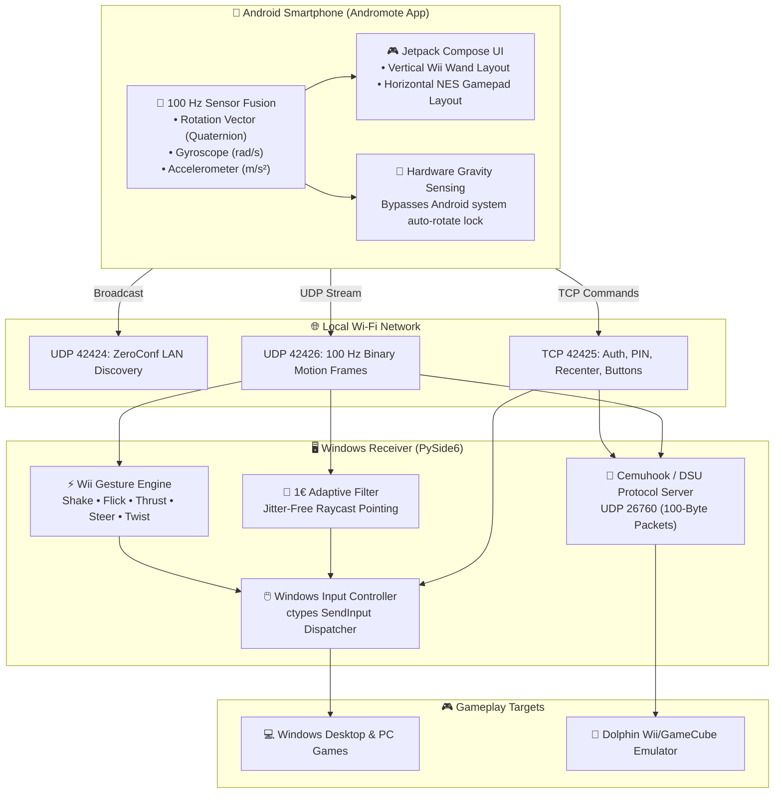
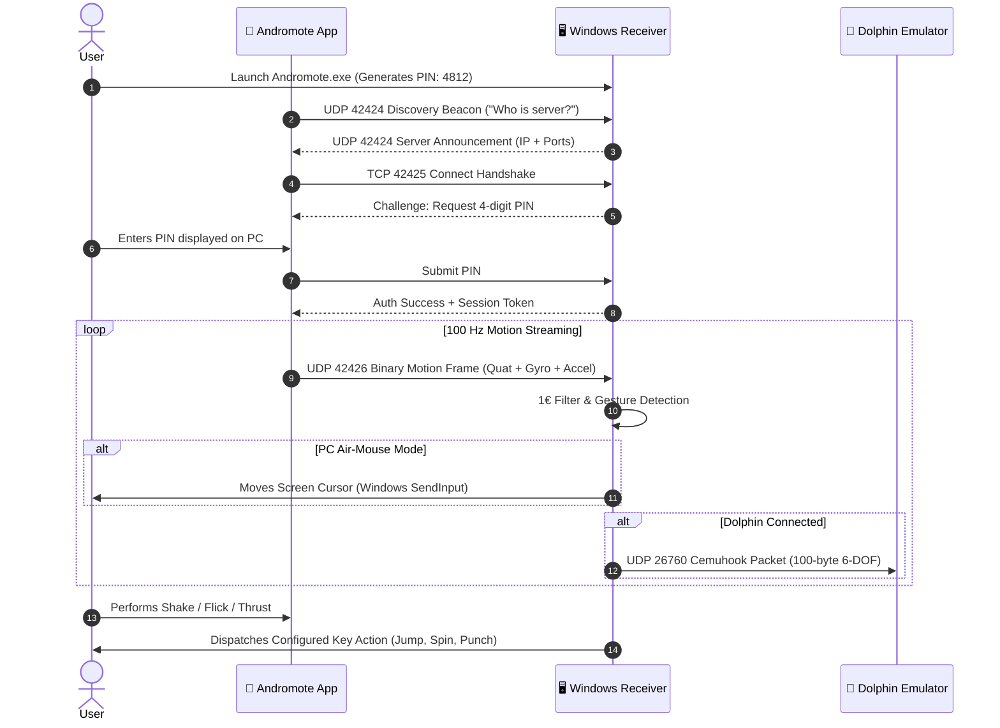
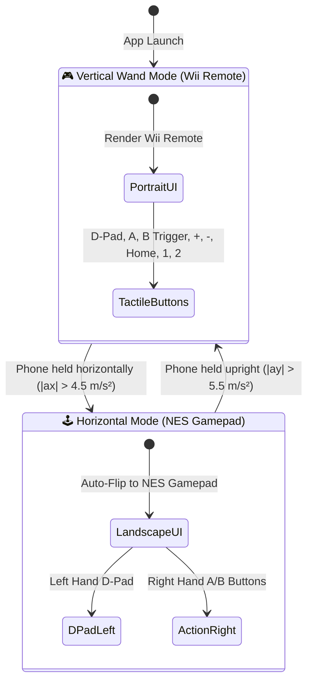

# Andromote 🎮📱

<div align="center">

[](#)
[](https://github.com/Hndrd0/Andromote/releases)
[](https://github.com/Hndrd0/Andromote/actions)
[](https://dolphin-emu.org/)
[](https://opensource.org/licenses/MIT)

**Turn any Android smartphone into an authentic, ultra-low-latency Nintendo Wii Remote, motion air-mouse, and retro NES gamepad for Windows PCs and the Dolphin Emulator.**

[🚀 Quick Start](#-quick-start) • [🎮 Controls](#-controls--how-to-use) • [⚡ Gestures](#-wii-motion-gestures) • [🐬 Dolphin Setup](#-dolphin-emulator-setup) • [🏗️ Technical Architecture](#-system-architecture--technical-details)

[⬇️ Download Latest Release (EXE & APK)](https://github.com/Hndrd0/Andromote/releases)

</div>

---

## 🚀 Quick Start

Get up and running in less than 2 minutes:

### 1. Download the Apps
Head to the **[Latest Releases](https://github.com/Hndrd0/Andromote/releases)** and grab:
* **`Andromote.exe`** for your Windows PC.
* **`Andromote.apk`** for your Android phone.

### 2. Launch PC Receiver
Double-click **`Andromote.exe`** on your PC. It will display a **4-digit PIN** (e.g., `4812`).

### 3. Open Phone App & Connect
1. Open **Andromote** on your phone (make sure both PC and phone are on the same Wi-Fi).
2. The phone will auto-discover your PC. Tap your PC's name in the list.
3. Enter the 4-digit PIN shown on your PC screen.
4. **Done!** Aim your phone at your monitor to move the cursor!

---

## 🎮 Controls & How to Use

### Wii Remote Wand Mode (Held Vertically)
* **Aiming:** Point the top of your phone at the monitor and move it naturally in the air.
* **A Button:** Left-Click on Windows / Action in Dolphin.
* **B Button (Underside Trigger):** Right-Click on Windows / Trigger in Dolphin.
* **Volume Keys:** The phone's physical **Volume Down** button also acts as the B trigger for a tactile grip!
* **D-Pad (▲ ▼ ◀ ▶):** Arrow keys for navigation / D-Pad in games.
* **+ and — Buttons:** Options & Select / Menu controls.
* **1 and 2 Buttons:** Game actions / Secondary triggers.
* **🏠 Recenter:** Hold your phone in a comfortable resting position and tap **Home** (or the on-screen **🎯 Recenter** button) to immediately re-zero the cursor center without jumping.

---

## 🕹️ Auto-Rotating NES Gamepad Mode

Turn your phone 90° sideways to play retro games or 2D platformers!

* **Automatic Layout Flip:** The screen instantly rearranges into an ergonomic classic NES layout:
  * **Left Thumb:** D-Pad directional controls.
  * **Right Thumb:** A, 1, 2 action buttons.
  * **Top/Shoulder:** B trigger.
* **Force Gravity Detection:** The app detects orientation using raw physical accelerometer gravity. **It rotates automatically even if your phone's system auto-rotate lock is enabled!**

---

## ⚡ Wii Motion Gestures

Andromote includes a real-time motion gesture engine that recognizes classic Wii Remote physical actions. You can customize what keys each gesture triggers in the receiver's **Wii Gestures** tab:

| Gesture | Real-World Motion | In-Game Action / Default Key |
| :--- | :--- | :--- |
| **⚡ Rapid Shaking** | Shake phone quickly back and forth | Spin attack / Shake off (`KEY_SPACE`) |
| **🎣 Wrist Snapping** | Sharp upward flick of the wrist | Cast fishing line / Jump (`KEY_UP`) |
| **🥊 Straight Thrust** | Punch / thrust phone straight forward | Jab / Sword lunge (`KEY_F`) |
| **🏎️ Tilt Steering** | Lean horizontal phone like a steering wheel | Steer Left / Right (`KEY_A` / `KEY_D`) |
| **💥 Off-Screen Reload** | Aim phone away from the monitor ($>32^\circ$) | Reload weapon (`KEY_R` / Right-Click) |
| **🔑 Key Twisting** | Fast wrist roll / tilt | Peek / Roll sideways (`KEY_Q` / `KEY_E`) |

> [!TIP]
> In the Windows app, open the **Wii Gestures** tab to watch live glowing green HUD indicator badges light up whenever you perform a gesture!

---

## 🐬 Dolphin Emulator Setup

Andromote features an integrated **Cemuhook / DSU motion server** running on UDP port `26760`. It streams calibrated 6-DOF gyroscope and accelerometer telemetry directly into Dolphin.

### Step-by-Step Setup:
1. Open **Dolphin Emulator** → click **Controllers**.
2. Under **Wii Remotes**, set **Wii Remote 1** to **Emulated Wii Remote** → click **Configure**.
3. Under **Motion Input**, check **Alternate Input Sources** (DSU Client):
   * **Server Address:** `127.0.0.1`
   * **Port:** `26760`
4. At the top of the Configure window, set **Device** to: `DSUClient/0/...`
5. **Map Your Buttons:**
   Click each button field in Dolphin and press the button on your phone (or right-click and type the identifier directly):

| Wii Remote Function | Phone Button | Dolphin Detected ID | Direct String |
| :--- | :--- | :--- | :--- |
| **Home** | 🏠 Home | **`PS`** | `PS` |
| **A** | A Button | **`Cross`** | `Cross` |
| **B (Trigger)** | B Trigger | **`R2`** | `R2` |
| **1** | 1 Button | **`Square`** | `Square` |
| **2** | 2 Button | **`Circle`** | `Circle` |
| **+ (Plus)** | + Button | **`Options`** | `Options` |
| **— (Minus)** | — Button | **`Share`** | `Share` |
| **D-Pad Up** | ▲ Up | **`Pad N`** | `Pad N` |
| **D-Pad Down** | ▼ Down | **`Pad S`** | `Pad S` |
| **D-Pad Left** | ◀ Left | **`Pad W`** | `Pad W` |
| **D-Pad Right** | ▶ Right | **`Pad E`** | `Pad E` |

> [!NOTE]
> You can also copy the pre-configured profile [`dolphin_profiles/WiimoteNew.ini`](dolphin_profiles/WiimoteNew.ini) into your Dolphin profiles folder (`%APPDATA%\Dolphin Emulator\Config\Profiles\Wiimote\`) and click **Load** in Dolphin!

---

<br/>

# 🏗️ System Architecture & Technical Details

*The section below is intended for developers, technical users, and anyone interested in the inner workings of Andromote.*

---

### High-Level Architecture



---

### Connection & Motion Handshake Pipeline



---

### Physical Orientation State Machine



---

<details>
<summary><b>📐 Mathematics: 1€ (One-Euro) Adaptive Filter</b></summary>

### 1€ Filter Formulation
Standard Exponential Moving Average (EMA) filters cause perceptible latency during rapid gestures when smoothed enough to stop resting jitter. Andromote implements the **1€ Filter (Casiez et al.)**, adjusting cutoff frequency dynamically based on hand speed:

$$\hat{x}_i = \alpha x_i + (1 - \alpha) \hat{x}_{i-1} \quad \text{where} \quad \alpha = \frac{1}{1 + \frac{\tau}{\Delta t}}, \quad \tau = \frac{1}{2\pi f_c}$$

Cutoff frequency $f_c$ scales dynamically:

$$f_c = f_{c,\min} + \beta \cdot |\dot{x}|$$

* **Rest / Slow Aiming ($|\dot{x}| \approx 0$):** $f_c = 1.0\text{ Hz}$, eliminating micro-tremors for pixel-precise targeting.
* **Rapid Flicks ($|\dot{x}| \gg 0$):** $f_c$ scales up automatically via $\beta = 0.05$, yielding zero input lag during fast sweeps.

</details>

<details>
<summary><b>🛠️ Building from Source</b></summary>

### Windows Receiver (Python)
* Requires **Python 3.10+**.
```cmd
git clone https://github.com/Hndrd0/Andromote.git
cd Andromote
pip install -r requirements.txt
python windows/main.py
```

To compile a standalone `.exe`:
```cmd
python windows/build_exe.py
# Output generated in dist/Andromote.exe
```

### Android App (Kotlin / Compose)
* Requires **Android Studio Ladybug+** and **JDK 21**.
```bash
cd android
./gradlew assembleDebug
# Output generated in android/app/build/outputs/apk/debug/app-debug.apk
```

</details>

<details>
<summary><b>🧪 Automated Test Suite</b></summary>

Andromote includes 22 automated unit and integration tests across 5 suites (100% passing):
```bash
python windows/tests/test_phase1.py   # Math utils, Quaternion, 1€ Filter, WinInput, Settings
python windows/tests/test_phase2.py   # Pairing PIN, Handshake, UDP Motion Framing
python windows/tests/test_dsu.py      # Dolphin Cemuhook 100-byte & PS Button
python windows/tests/test_e2e.py      # Full client-server synthetic stream
python windows/tests/test_gestures.py # Shake, Flick, Thrust, Steer, Off-Screen, Twist
```

</details>

---

## 📄 License

Distributed under the **MIT License**. See [`LICENSE`](LICENSE) for more details.

---

## 🤝 Contributing

Contributions, bug reports, and feature suggestions are warmly welcomed! Please read [`CONTRIBUTING.md`](CONTRIBUTING.md) to get started.
